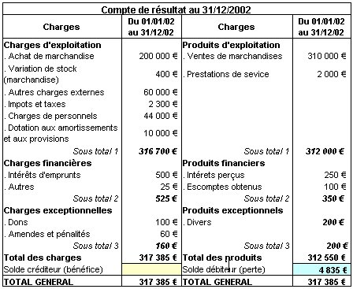

## Page 1

Document de test OCR

Corpus de tableaux pour pipeline RAG actuariel

Ce document a été généré automatiquement pour tester l'extraction de texte et de tableaux par un moteur OCR (Tesseract, docling, Azure Document Intelligence, etc.). Il contient dix pages mélant paragraphes courants, tableaux financiers, techniques et démographiques.

L'objectif est de vérifier la qualité de l'extraction sur des structures hétérogènes : tableaux à colonnes étroites, valeurs numériques avec séparateurs, en-têtes fusionnés conceptuellement, et alternance texte/tableau dans la même page.

Métadonnées du document

| Champ | Valeur |
| :--- | :--- |
| Titre | Document de test OCR — Tableaux |
| Version | 1.0 |
| Date | 22 mai 2026 |
| Pages | 10 |
| Langue | Français |
| Encodage | UTF-8 |
| Format | PDF/A compatible |

## Page 2

1. Bilan comptable au 31/12/2025

Présentation simplifiée du bilan d'une compagnie d'assurance fictive. Les montants sont exprimés en milliers d'euros.

| Poste | 2024 (k€) | 2025 (k€) | Variation |
| :--- | :--- | :--- | :--- |
| Immobilisations incorporelles | 12 450 | 13 820 | +11,0 % |
| Immobilisations corporelles | 84 300 | 86 100 | +2,1 % |
| Placements financiers | 1 245 600 | 1 312 400 | +5,4 % |
| Créances | 76 200 | 82 050 | +7,7 % |
| Disponibilités | 42 800 | 38 900 | -9,1 % |
| Total actif | 1 461 350 | 1 533 270 | +4,9 % |
| Capitaux propres | 412 000 | 438 500 | +6,4 % |
| Provisions techniques | 956 700 | 998 200 | +4,3 % |
| Dettes | 92 650 | 96 570 | +4,2 % |
| Total passif | 1 461 350 | 1 533 270 | +4,9 % |

Le total bilanciel progresse de 4,9 % sur l'exercice, porté principalement par la valorisation du portefeuille de placements.

.

# lorem ipsum dolor sit amet, consectetur adipiscing elit. 

Sed do eiusmod tempor incididunt ut labore et dolore magna aliqua. Ut enim ad minim veniam, quis nostrud exercitation ullamco laboris nisi ut aliquip ex ea commodo consequat. Duis aute irure dolor in reprehenderit in voluptate velit esse cillum dolore eu fugiat nulla pariatur. Excepteur sint occaecat cupidatat non proident, sunt in culpa qui officia deserunt mollit anim id est laborum.